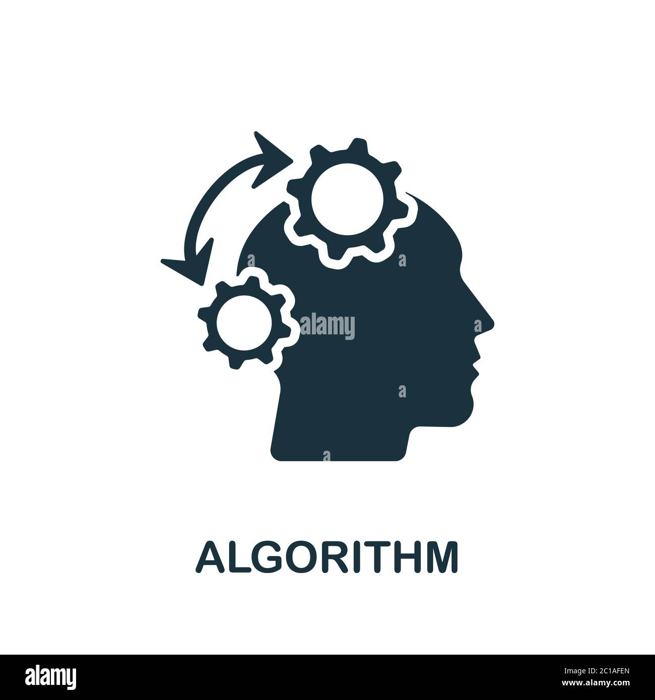
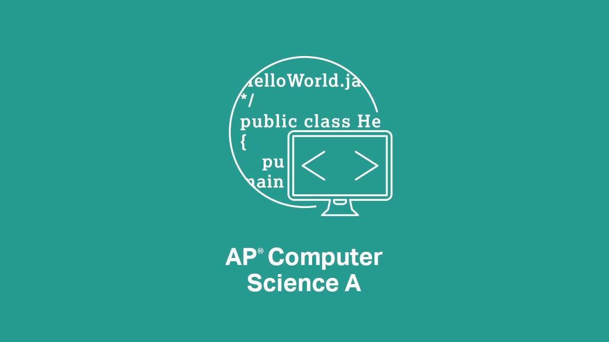

<h3 style="text-align: center;">AIcoding</h3>

<table>
  
  <tr>
    <td></td>
    <td></td>
  </tr>

  <tr>
    <td>
Python Fundamental I & II
</td>
     <td>
Java Fundamental I & II
</td>
  </tr>

  <tr>
    <td>
Age: 10-18
</td>
     <td>
Age: 10-18
</td>
  </tr>
 </table>

  
  

<table>

  <tr>
    <td></td>
    <td></td>
  </tr>

  <tr>
    <td>
C++ Fundamental I & II
</td>
     <td>
Data Structure
</td>
  </tr>

  <tr>
    <td>
Age: 10-18
</td>
     <td>
Age: 10-18
</td>
  </tr>
 </table>

  
  

<table>

  <tr>
    <td></td>
    <td></td>
  </tr>

  <tr>
    <td>
Algorithm
</td>
     <td>
AP Computer Science A
</td>
  </tr>

  <tr>
    <td>
Age: 10-18
</td>
     <td>
Age: 10-18
</td>
  </tr>
 </table>

  
  

<table>

  <tr>
    <td></td>
    <td></td>
  </tr>

  <tr>
    <td>
USA Computing Olympiad
</td>
     <td>
Machine Learning & Artificial Intelligence Fundamental
</td>
  </tr>

  <tr>
    <td>
Age: 10-18
</td>
     <td>
Age: 10-18
</td>
  </tr>
 </table>
